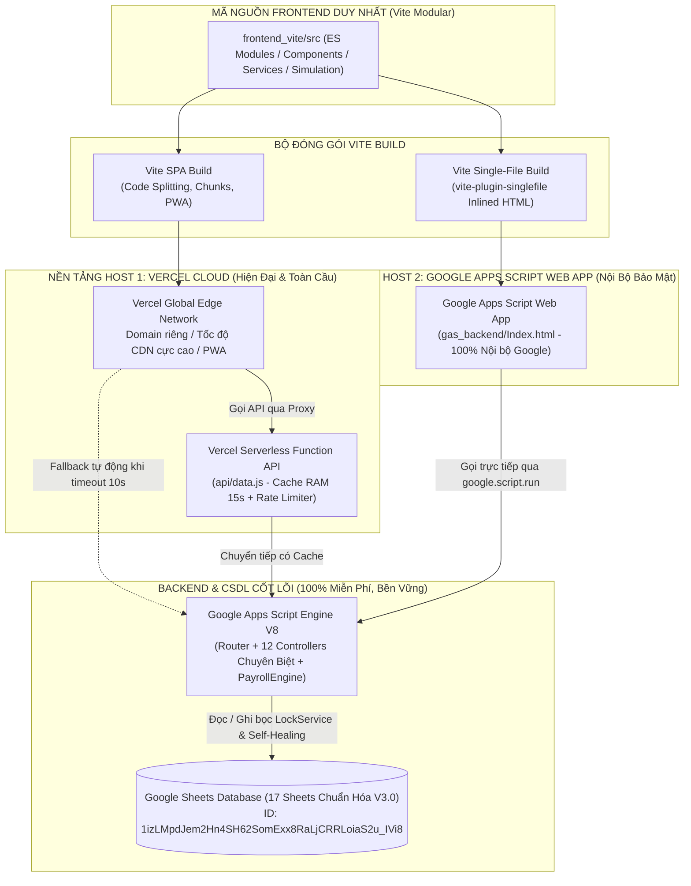

# 🏛️ HỆ THỐNG QUẢN TRỊ LƯƠNG, NHÂN SỰ, CHẤM CÔNG & KPI 2027 PRO V3
## QUỸ TÍN DỤNG NHÂN DÂN YÊN THỌ

[](https://github.com/)
[](https://github.com/)
[-purple.svg)](https://github.com/)
[-yellow.svg)](https://docs.google.com/spreadsheets/d/1izLMpdJem2Hn4SH62SomExx8RaLjCRRLoiaS2u_IVi8/edit)

> **Đơn vị quản lý**: Quỹ tín dụng nhân dân Yên Thọ  
> **Địa chỉ**: Thôn Tân Lộc, xã Quý Lộc, tỉnh Thanh Hoá  
> **Hệ thống**: Nền tảng Quản trị Tiền lương, Nhân sự 360°, Chấm công, KPI & Mô phỏng Tài chính Quỹ Lương 2027  
> **Trạng thái**: Đã nghiệm thu & Triển khai Live (Phiên bản V3.0 - Version #17)

---

## 🌟 1. Giới Thiệu & Tầm Nhìn Hệ Thống

Hệ thống **Quản Trị Lương 2027 Pro V3** được thiết kế chuyên biệt và tối ưu hóa 100% theo đặc thù mô hình tài chính - ngân quỹ của Quỹ tín dụng nhân dân Yên Thọ:
- **Tách bạch cấu trúc & Tùy biến linh hoạt**: Loại bỏ hoàn toàn việc hardcode phương án lương cứng nhắc (bỏ PA1/PA2/PA3). Toàn bộ hệ số lương, bảng ngạch 5 bậc, định mức khoán, tỷ lệ thâm niên, cơ chế vượt khung và tham số pháp lý đều được cấu hình động trên Google Sheets và giao diện Mô phỏng.
- **Hồ sơ nhân sự số hóa 360°**: Quản lý đầy đủ lý lịch trích ngang, 5 bậc ngạch, thâm niên chức vụ tính từ ngày đảm nhiệm thực tế, năm thâm niên quy đổi, mức đóng BHXH cá nhân hóa và các liên kết Google Drive số hóa (Hợp đồng lao động, Phụ lục hợp đồng, Quyết định bổ nhiệm/nâng bậc).
- **Bộ 3 công cụ xuất báo cáo tài chính chuyên nghiệp**: Hỗ trợ xuất dữ liệu bảng lương ra file Excel (.xls), xuất ảnh Canvas High-DPI (2x scale) và in báo cáo / xuất PDF khổ A4 Ngang chuẩn thể thức văn bản hành chính Quỹ tín dụng (có đầy đủ khối 3 chữ ký: Người lập biểu, Kế toán trưởng, Giám đốc / Chủ tịch HĐQT).

---

## 🏛️ 2. Kiến Trúc Kỹ Thuật Đa Nền Tảng (Dual-Platform Architecture)



---

## 📋 3. Bản Đồ 7 Phân Hệ Nghiệp Vụ Cốt Lõi

1. **Mô Phỏng Lương Động (Dynamic Simulation)**:
   - Tinh chỉnh trực quan toàn bộ tham số: Lương cơ sở, tỷ lệ thâm niên, vượt khung, trần BHXH, giảm trừ thuế.
   - Thử nghiệm các kịch bản mô phỏng mới, so sánh chi phí quỹ lương và thu nhập bình quân.
   - Bộ 3 nút xuất báo cáo tức thì: **Xuất Excel**, **Xuất Ảnh 2x**, **In Báo Cáo A4 kèm 3 chữ ký**.
2. **Quản Lý Nhân Sự 360° (Staff 360)**:
   - Hồ sơ 12 CBNV thực tế với đầy đủ thông tin định danh, CCCD 12 số, tài khoản Agribank.
   - Quản lý ngạch bậc (Bậc 1 đến 5), ngày đảm nhiệm chức vụ, thâm niên quy đổi.
   - Quản lý mức đóng BHXH cá nhân hóa (hoàn trả tiền thừa bảo hiểm cộng vào Gross).
   - Quản lý liên kết Google Drive số hóa: HĐLĐ, Phụ lục HĐ, Quyết định bổ nhiệm.
3. **Bảng Chấm Công Hàng Tháng (Timesheets)**:
   - Chấm công chuẩn 22 ngày, công thực tế, nghỉ phép năm, nghỉ ốm, nghỉ không lương.
   - Tự động tính hệ số ngày công hưởng lương thời gian.
4. **Đánh Giá Chỉ Số KPI Tháng (KPI Management)**:
   - Danh mục từ điển KPI tín dụng, huy động vốn, kế toán, kiểm soát, kho quỹ.
   - Đánh giá theo trọng số (%) và chấm điểm thực hiện (0 - 120%).
5. **Tính Toán Bảng Lương 4 Tầng (Payroll Engine)**:
   - Bóc tách 22 chỉ tiêu tài chính: Lương ngạch bậc, thâm niên, vượt khung, phụ cấp trách nhiệm, khoán công tác, lương KPI, thưởng, hoàn tiền thừa BHXH, thuế TNCN lũy tiến 7 bậc, thực lĩnh Net, chi phí Quỹ.
   - Lưu kết quả dự thảo vào `KQ_LUONG_THANG`.
   - Khóa sổ vĩnh viễn (Lock Payroll) vào `BL_LICHSU` bọc `LockService` atomicity.
6. **Báo Cáo & Xuất Dữ Liệu Đa Kênh**:
   - Xuất Excel bảng thanh toán tiền lương chuẩn.
   - Xuất file ảnh Canvas 2x High-DPI gửi nhanh Zalo/Mobile.
   - In ấn / Xuất PDF khổ A4 Ngang chuẩn văn bản hành chính Quỹ tín dụng có đủ 3 chữ ký.
7. **Cổng Tự Phục Vụ CBNV & Quản Trị Hệ Thống**:
   - Tra cứu phiếu lương cá nhân bảo mật theo từng tài khoản.
   - Hộp thư phản hồi thắc mắc lương 2 chiều (Sheet `PHAN_HOI`).
   - Phân quyền RBAC 4 cấp (`SUPER_ADMIN`, `KE_TOAN`, `LANH_DAO`, `NHAN_VIEN`).
   - Nhật ký truy vết an toàn thông tin bất biến (`AUDIT_LOG`).

---

## 📊 4. Cơ Sở Dữ Liệu 17 Sheets Chuẩn Hóa

| STT | Mã Sheet | Tên Đầy Đủ Của Sheet | Số Cột | Ý Nghĩa Lưu Trữ |
|:---:|:---|:---|:---:|:---|
| **1** | `DM_NS` | Danh mục Nhân sự 360° | 30 | Hồ sơ 12 CBNV, CCCD, MST, NPT, số TK, ngày đảm nhiệm CV, thâm niên quy đổi, bậc, năm vượt khung, mức đóng BHXH, link Drive |
| **2** | `LS_CONGTAC` | Lịch sử Công tác & Quyết định | 18 | Quyết định bổ nhiệm, nâng ngạch bậc, thâm niên, link quyết định Drive |
| **3** | `DM_CHUCDANH`| Khung Chức danh & 5 Bậc Lương | 27 | 10 chức danh, hệ số 5 bậc ngạch (Bậc 1-5), nhóm khoán, % vượt khung, chu kỳ nâng bậc 3 năm |
| **4** | `DM_KPI` | Từ điển Chỉ số KPI nghiệp vụ | 6 | Danh mục chỉ số đo lường hiệu quả công việc chuyên môn QTDND |
| **5** | `CHAM_CONG` | Chấm công & Ngày phép tháng | 11 | Số ngày công chuẩn, công thực tế, nghỉ phép, không lương, nghỉ chế độ |
| **6** | `DG_KPI` | Đánh giá chi tiết KPI tháng | 10 | Chấm điểm thực hiện từng chỉ số theo CBNV và trọng số |
| **7** | `BL_LICHSU` | Lịch sử Bảng lương khóa sổ | 35 | Bảng lương đã chốt vĩnh viễn, lưu vết chi tiết 22 chỉ tiêu tài chính |
| **8** | `TAIKHOAN` | Quản lý Tài khoản & Phân quyền | 9 | Tài khoản đăng nhập, mật khẩu mã hóa SHA-256, vai trò RBAC 4 cấp |
| **9** | `AUDIT_LOG` | Nhật ký Truy vết & Thao tác | 7 | Ghi vết mọi lượt đăng nhập, tính lương, chốt lương, sửa hồ sơ |
| **10**| `PHAN_HOI` | Hộp thư Phản hồi thắc mắc lương | 9 | CBNV gửi câu hỏi về lương; Kế toán giải trình minh bạch |
| **11**| `THAM_SO` | Tham số Hệ thống & Tỷ lệ Thuế/BHXH | 5 | Lương cơ sở, mức giảm trừ gia cảnh, tỷ lệ trích nộp BHXH |
| **12**| `DM_PHU_CAP` | Danh mục Phụ cấp & Khoán công vụ | 14 | Quy tắc tính BHXH, tính thuế TNCN, mức trần miễn thuế, nhóm áp dụng |
| **13**| `LS_KHOAN` | Lịch sử Thay đổi Định mức Khoán | 14 | Lưu vết lịch sử SCD-2 khi HĐQT điều chỉnh mức phụ cấp khoán |
| **14**| `DM_BAC_LUONG`| Bảng Lương Ngạch Bậc (5 Bậc) | 8 | Chi tiết ma trận 5 bậc ngạch của 10 chức danh theo lương cơ sở |
| **15**| `DM_THAM_SO_LUONG`| Tham số Pháp lý & Lương Nghiệp vụ | 10 | Cấu hình Lương cơ sở, BHXH trần, giảm trừ thuế TNCN, thâm niên, vượt khung |
| **16**| `DM_CONG_THUC`| Danh mục Công thức 4 Tầng Lương | 10 | 13 công thức tính toán từ lương vị trí, KPI, khoán đến Net và chi phí Quỹ |
| **17**| `KQ_LUONG_THANG`| Kết quả Tính Lương Tháng (DRAFT/LOCK)| 40 | Bảng kết quả tính toán chi tiết 22 mục cho 12 CBNV từng kỳ lương |

---

## 🔗 5. Định Danh Kỹ Thuật & Tài Nguyên Hệ Thống

- **Google Sheet CSDL ID**: `1izLMpdJem2Hn4SH62SomExx8RaLjCRRLoiaS2u_IVi8`
  - [Mở CSDL Google Sheets](https://docs.google.com/spreadsheets/d/1izLMpdJem2Hn4SH62SomExx8RaLjCRRLoiaS2u_IVi8/edit)
- **Google Apps Script Project ID**: `14TIgLHDC9mjNsuvzsXOhRSF5LWIzGkXzzapwMREE7F49NDNNHdZJ5hCr`
  - [Mở Dự Án Apps Script](https://script.google.com/d/14TIgLHDC9mjNsuvzsXOhRSF5LWIzGkXzzapwMREE7F49NDNNHdZJ5hCr/edit)
- **Live Web App URL (V3.0)**:
  - [Mở Web App Trực Tiếp](https://script.google.com/macros/s/AKfycbxTcci9TP-vI1YNP1zJiD4l_3F9SUEmjSlzxvDFVrFL/exec)

---

## 💻 6. Hướng Dẫn Phát Triển & Lệnh Thực Thi

Cài đặt các gói phụ thuộc:
```bash
npm install
```

Khởi chạy máy chủ thử nghiệm cục bộ:
```bash
npm run dev
```

Biên dịch bản dựng Singlefile cho Google Apps Script:
```bash
npm run build:gas
```

Đẩy mã nguồn và cập nhật phiên bản Web App tự động:
```bash
npm run push
```

Chạy quy trình tự động khép kín toàn diện (Build -> Push GAS -> Deploy Live -> Cập nhật CSDL):
```bash
npm run deploy:all
```

---

## 🛡️ 7. Tiêu Chuẩn Văn Hóa Lập Trình & An Toàn Dữ Liệu
- **Zero AI UI**: Không dùng biểu tượng sparkles, bot ảo, văn phong robot trên giao diện.
- **Typography & Brand Identity**: 100% font chữ `Be Vietnam Pro`, `tabular-nums` cho số liệu tài chính. Màu sắc thương hiệu: Navy `#17365d` và Brand Lime `#9ACD32`.
- **Zero Data Loss**: Tự động chữa lành CSDL qua `SchemaManager.ensureDatabaseSchema()`, bảo tồn 100% dữ liệu cũ khi nâng cấp.
