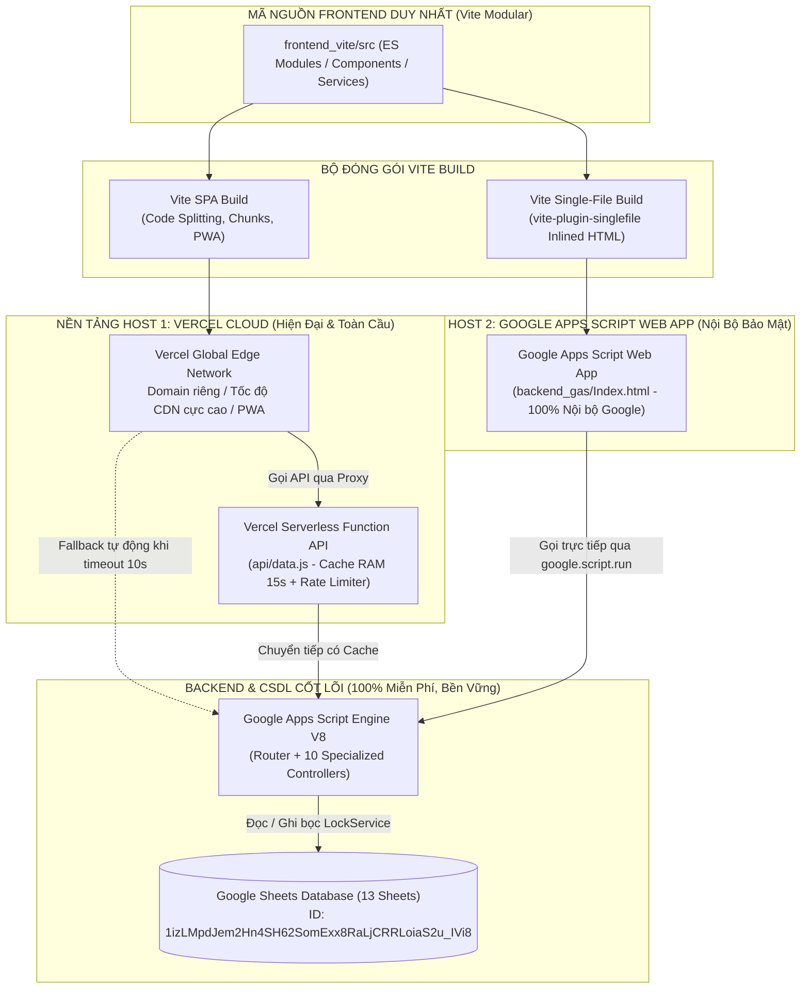

# 🏛️ TỔNG QUAN KIẾN TRÚC DUAL-PLATFORM & LUỒNG DỮ LIỆU
## Dự Án: Hệ Thống Quản Trị Lương, Nhân Sự, Chấm Công & KPI 2027 Pro V2
### Đơn Vị Vận Hành: Quỹ Tín Dụng Nhân Dân Yên Thọ (Thôn Tân Lộc, Xã Quý Lộc, Tỉnh Thanh Hoá)

---

## 1. Bối Cảnh & Triết Lý Kiến Trúc Đa Nền Tảng (Dual-Platform Architecture)

Trong môi trường tài chính - ngân hàng nhân dân, bài toán đặt ra là:
- **Tính tiện ích & Hiện đại**: Cần một giao diện Web/Mobile tốc độ cao, hỗ trợ PWA (Progressive Web App), thao tác mượt mà trên điện thoại và máy tính để CBNV tra cứu lương mọi lúc mọi nơi.
- **Tính bảo mật & Độc lập nội bộ**: Cần một phương án dự phòng 100% tự chủ, có thể chạy độc lập hoàn toàn trong hệ sinh thái Google Workspace nội bộ của Quỹ, không phụ thuộc vào bất kỳ máy chủ bên thứ ba nào (Vercel, AWS...). Khi có sự cố đứt cáp Internet quốc tế hoặc chính sách thắt chặt an ninh mạng, cán bộ vẫn lập bảng lương và chốt lương an toàn 100%.

Do đó, dự án được xây dựng theo mô hình **Dual-Platform Architecture (Đa nền tảng Host độc lập)**, tương tự như kiến trúc đã kiểm chứng thành công ở dự án `Qtdyentho` và `TaiKhoanLuong`:

---

## 2. So Sánh Hai Nền Tảng Triển Khai (Host Platforms)

| Tiêu Chí So Sánh | Nền Tảng 1: Vercel Cloud (SPA) | Nền Tảng 2: Google Apps Script Web App |
|:---|:---|:---|
| **Hình thức đóng gói** | Multi-file SPA (HTML + JS Chunks + CSS + Assets) | Single-file Bundle (100% nhúng vào 1 file `Index.html`) |
| **Hạ tầng máy chủ** | Vercel Edge Network (Toàn cầu) | Google Cloud / Google Workspace nội bộ |
| **Tên miền & Truy cập** | Domain riêng (ví dụ `luong.qtdyentho.vn` hoặc `.vercel.app`) | `https://script.google.com/macros/s/.../exec` |
| **Tốc độ tải trang ban đầu** | Siêu tốc (< 500ms qua CDN) | 1.2s - 2.5s (qua Google Apps Script Sandbox) |
| **Tính năng di động** | Hỗ trợ PWA (Cài đặt Icon ra màn hình chính) | Mở qua trình duyệt hoặc ghim tab Workspace |
| **Cơ chế Proxy & Cache** | Vercel Serverless Function cache RAM 15s, rate limit 120req/p | CacheService (6h) trên Google Apps Script |
| **Bảo mật mạng** | Chứng chỉ SSL/TLS tự động, DDoS protection | Đăng nhập tài khoản Google Workspace nội bộ |
| **Độ độc lập máy chủ** | Cần kết nối Internet ra hạ tầng Vercel | Chạy vĩnh viễn, không lo sập server bên thứ ba |

---

## 3. Cơ Chế Dual-Path Fallback (Đường Truyền Kép Tự Khắc Phục Lỗi)

Trong mã nguồn Frontend (`src/services/api.js`), hệ thống triển khai cơ chế **Dual-Path Fallback**:
1. **Đường truyền chính (Primary)**: Trình duyệt gửi request tới Vercel Proxy endpoint (`/api/data`). Vercel phản hồi từ cache RAM (nếu còn hạn 15s) hoặc chuyển tiếp tới Google Apps Script.
2. **Đường truyền dự phòng (Fallback)**: Nếu Vercel gặp lỗi 502/504 (timeout quá 9.2 giây) hoặc mạng quốc tế gián đoạn:
   - Client tự động chuyển sang gọi trực tiếp `DIRECT_GAS_URL` (`https://script.google.com/.../exec`).
   - Quá trình chuyển đổi diễn ra ngầm, có thông báo trạng thái nhẹ nhàng ở góc màn hình, tuyệt đối không làm đơ giao diện hay gián đoạn phiên làm việc của cán bộ.

---

## 4. Bản Đồ Dòng Dữ Liệu Toàn Dự Án (End-to-End Data Flow)

| Bước | Hành Động Người Dùng | Frontend Module | Backend Controller | Sheet CSDL Tác Động |
|:---:|:---|:---|:---|:---|
| **B1** | Cán bộ đăng nhập hệ thống | `src/modules/auth/` | `AuthController.login()` | Kiểm tra `TAIKHOAN`, ghi vào `AUDIT_LOG` |
| **B2** | Nạp dữ liệu tổng quan đầu ngày | `src/modules/dashboard/` | `Code.js` + `SchemaManager.js` | Đọc 13 Sheets, tự động sửa lỗi cấu trúc nếu thiếu |
| **B3** | Chấm công tháng (Công chuẩn, nghỉ phép) | `src/modules/timesheets/` | `TimesheetController.saveTimesheet()` | Cập nhật bảng `CHAM_CONG` |
| **B4** | Chấm điểm đánh giá KPI tháng | `src/modules/kpi/` | `KpiController.saveEvaluation()` | Cập nhật bảng `DG_KPI` |
| **B5** | Điều chỉnh định mức phụ cấp khoán | `src/modules/allowances/` | `AllowanceController.updateAllowance()` | Cập nhật `DM_PHU_CAP`, ghi lịch sử `LS_KHOAN` (SCD-2) |
| **B6** | Tính toán bảng lương dự kiến | `src/modules/payroll/` | `PayrollController.calculatePayroll()` | Tính RAM 4 tầng: Ngạch bậc, KPI, Khoán, Thuế/BHXH |
| **B7** | Phê duyệt & Khóa sổ bảng lương | `src/modules/payroll/` | `PayrollController.lockPayroll()` | Ghi bất biến vào `BL_LICHSU` (bọc `LockService`) |
| **B8** | CBNV tra cứu phiếu lương cá nhân | `src/modules/selfservice/` | `StaffController.getMyPayroll()` | Đọc dòng lương của chính mình từ `BL_LICHSU` |
| **B9** | CBNV gửi phản hồi thắc mắc lương | `src/modules/selfservice/` | `AuditController.submitFeedback()` | Ghi nhận câu hỏi vào bảng `PHAN_HOI` |

---

## 5. Định Danh Kỹ Thuật & Cấu Hình Cốt Lõi

- **Tên dự án**: Hệ thống Quản trị Lương, Chấm công & KPI 2027 Pro V2
- **Mã hệ thống**: `QTDND_YenTho_Luong`
- **Google Apps Script ID**: `14TIgLHDC9mjNsuvzsXOhRSF5LWIzGkXzzapwMREE7F49NDNNHdZJ5hCr`
- **Google Sheets ID**: `1izLMpdJem2Hn4SH62SomExx8RaLjCRRLoiaS2u_IVi8`
- **Live Deployment ID**: `AKfycbzSoUIc-pPxd_pYa9W2GhnbAF6NRGPph4ple_QoumTgtWvG1TlG6KcjJf5Pd74IVnGJtw`
- **Live Web App URL**: `https://script.google.com/macros/s/AKfycbzSoUIc-pPxd_pYa9W2GhnbAF6NRGPph4ple_QoumTgtWvG1TlG6KcjJf5Pd74IVnGJtw/exec`
- **Múi giờ chuẩn**: GMT+7 (`Asia/Ho_Chi_Minh`)
- **Ngôn ngữ giao diện**: 100% Tiếng Việt chuẩn mực nghiệp vụ tài chính, ngân quỹ.
