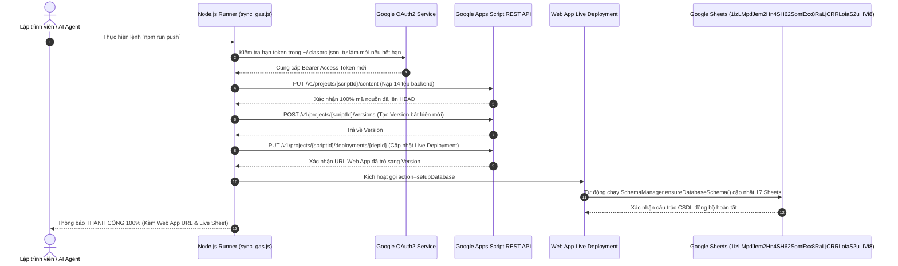

# 🚀 QUY TRÌNH TỰ ĐỘNG HÓA CI/CD & ĐẨY CODE LÊN GOOGLE APPS SCRIPT
## Dự Án: Hệ Thống Quản Trị Lương, Nhân Sự, Chấm Công & KPI 2027 Pro V3
### Đơn Vị: Quỹ Tín Dụng Nhân Dân Yên Thọ

---

## 1. Hai Quy Tắc Bắt Buộc Tuyệt Đối Cho Mọi Thay Đổi Mã Nguồn

> ⚠️ **QUY TẮC CỐT LÕI SỐ 1: TỰ ĐỘNG ĐẨY CODE & DEPLOY LIVE NGAY LẬP TỨC**
> Bất kỳ thay đổi mã nguồn nào liên quan đến Google Apps Script (`gas_backend/`) **BẮT BUỘC** phải được tự động đẩy lên và deploy live ngay lập tức thông qua lệnh `npm run push` (hoặc `node sync_gas.js`). Tuyệt đối không để mã nguồn tồn tại cục bộ trên máy mà không đồng bộ lên Cloud.

> ⚠️ **QUY TẮC CỐT LÕI SỐ 2: TỰ ĐỘNG THỰC THI & CHỮA LÀNH CSDL GOOGLE SHEETS**
> Bất kỳ thay đổi nào liên quan đến cấu trúc Google Sheets, tên 17 bảng viết tắt, hoặc thêm mới/chỉnh sửa các cột dữ liệu: Hệ thống **BẮT BUỘC** phải tự động chạy cập nhật lên Google Sheet trực tiếp (`1izLMpdJem2Hn4SH62SomExx8RaLjCRRLoiaS2u_IVi8`) thông qua hàm `ensureDatabaseSchema()`, đồng thời bảo toàn 100% dữ liệu cũ (Zero Data Loss).

---

## 2. Kiến Trúc Bộ Đẩy Code Tự Động (`sync_gas.js`)

Do công cụ Clasp mặc định đôi khi bị treo trên Windows hoặc hết hạn Token OAuth2, hệ thống sử dụng bộ điều khiển tự động hóa độc quyền `sync_gas.js` với các tính năng vượt trội:

---

## 3. Hệ Thống Script Quản Trị Tại `package.json`

| Lệnh Thực Thi | Mục Đích & Chu Trình Xử Lý |
|:---|:---|
| `npm run dev` | Khởi chạy máy chủ phát triển Frontend Vite cục bộ (Hot Module Replacement) |
| `npm run build:spa` | Biên dịch bản dựng SPA tối ưu để đưa lên Vercel Cloud |
| `npm run build:gas` | Biên dịch bản dựng Single-file nhúng toàn bộ vào `gas_backend/Index.html` |
| `npm run push` | Tự động làm mới token, đẩy code backend lên Google Apps Script & deploy Web App Version mới |
| `npm run sync:schema` | Kích hoạt cập nhật cấu trúc 17 sheets trực tiếp trên Google Sheets qua REST API |
| `npm run deploy:all` | Quy trình khép kín: Build Singlefile -> Đẩy GAS -> Deploy Live -> Cập nhật CSDL 17 Sheets |

---

## 4. Bảo Vệ An Toàn Dữ Liệu Khi Cập Nhật Cột Mới (Zero Data Loss)

Khi nghiệp vụ phát sinh thêm các cột mới (như liên kết Google Drive HĐLĐ, Phụ lục, QĐ; Bậc ngạch; Năm vượt khung; Mức đóng BHXH cá nhân):
1. Thêm định nghĩa cột vào mảng cấu hình trong `SchemaManager.js` (`SHEET_DEFINITIONS`).
2. Hàm `ensureDatabaseSchema()` khi chạy sẽ:
   - Đọc hàng tiêu đề hiện tại của từng Sheet trong 17 Sheet.
   - So sánh danh sách cột mới với cột hiện có.
   - Nếu phát hiện cột mới chưa có, hàm sẽ tự động chèn thêm cột vào cuối bảng và định dạng tiêu đề Navy chuẩn mực.
   - **Tuyệt đối không xóa, không ghi đè, bảo toàn nguyên vẹn 100% các dòng dữ liệu 12 CBNV và lịch sử lương đã chốt trước đó**.
